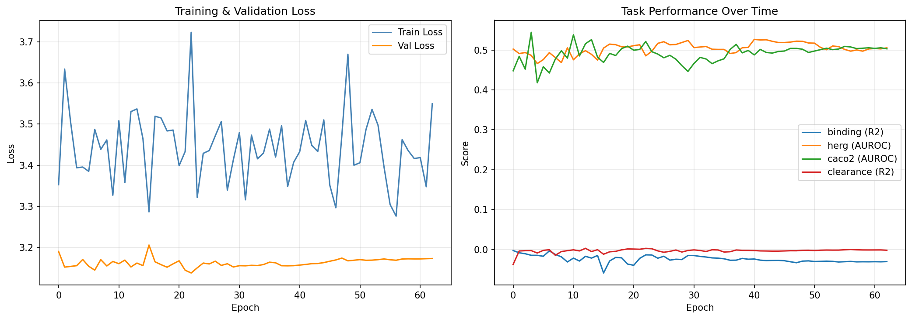
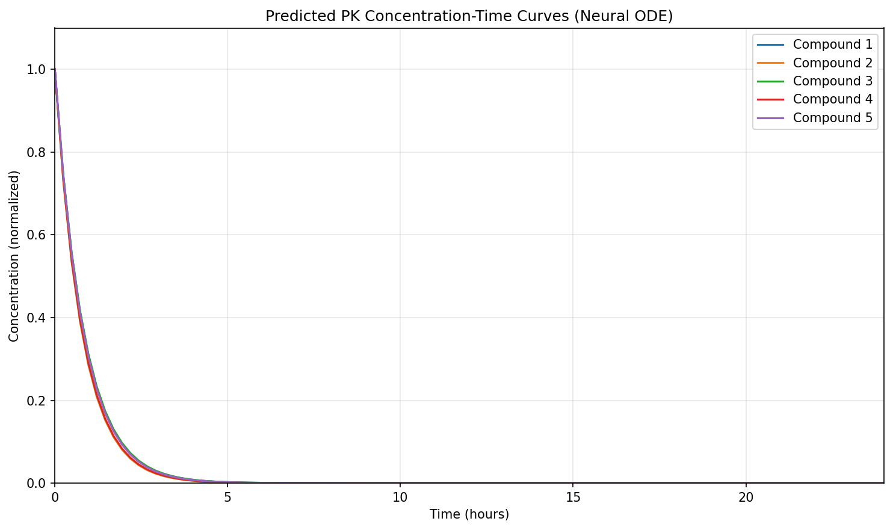

# Phase 3B Presentation Material (18 Slides, Technical Deep Dive)

## Project Overview
Phase 3B: Multi-Task Neural PK-PD Model with Neural ODE
- Focus: architecture, theory, training protocol, and baseline behavior.
- This section positions Phase 3B as the technical bridge between feature engineering and fine-tuning.

## Agenda
- Problem framing
- Theoretical basis
- Data and features
- Detailed architecture
- Training and evaluation protocol
- Results, risks, and next experiments
- The flow moves from motivation to implementation details and then to evidence and decision points.

## Problem Framing
- Need a single model for efficacy and ADMET endpoints.
- Separate models ignore shared molecular signal.
- PK-PD workflows also require mechanistic trajectory behavior, not only endpoint prediction.
- The core challenge is balancing predictive performance and biological plausibility in one system.

| Challenge | Consequence if Ignored | Requirement |
|---|---|---|
| Multi-endpoint modeling | Fragmented models and inconsistent decisions | One shared framework |
| Limited data for some tasks | Overfitting and unstable performance | Transfer through shared representation |
| PK interpretability need | Hard to trust endpoint-only predictions | Mechanistic trajectory component |

## Why Multi-Task Learning
- Shared encoder acts as inductive transfer across related tasks.
- Hard parameter sharing lowers overfitting risk on smaller tasks.
- Task-specific heads preserve specialization where task distributions differ.
- Expected benefit: stronger latent features for low-data tasks via shared supervision.

## Why Neural ODE for PK
- Continuous-time latent dynamics are natural for concentration-time curves.
- ODE solver enables trajectory prediction at arbitrary time grids.
- Mechanistic prior: first-order elimination behavior can be encoded in the dynamics form.
- This avoids forcing PK behavior into fixed discrete-time layers.

## Data Pipeline Overview
- Source features from Phase 3A artifacts and bridge outputs.
- Per-task arrays rebuilt into train/val/test DataLoaders.
- Task-wise preprocessing preserves target semantics for regression vs classification.
- Pipeline design ensures repeatable transformations before every training run.

## Feature Space Details
- Input vector combines:
	- physicochemical descriptors
	- Morgan fingerprint bits
	- docking_quality bridge feature
- Unified input dimension across all four tasks.
- Consistent feature schema allows one encoder to serve all endpoints.

## Structure-to-Binding-to-PK Bridge
- RapidDock geometry quality aggregated per target.
- Target-level docking_quality injected into binding samples.
- Non-target ADMET tasks receive zero-padding for same feature schema.
- This design injects structure-derived signal without breaking task compatibility.

## Shared Encoder Architecture
- Block 1: Linear(input_dim, hidden_dim) + LayerNorm + ReLU + Dropout
- Block 2: Linear(hidden_dim, hidden_dim) + LayerNorm + ReLU + Dropout
- Projection: Linear(hidden_dim, latent_dim) + ReLU
- LayerNorm chosen for stability in interleaved multi-task batches.
- The encoder is intentionally deep enough for nonlinear chemistry patterns while still trainable.

| Module | Inputs | Core Computation | Output | Purpose |
|---|---|---|---|---|
| SharedEncoder | Feature vector | 2x Linear + LayerNorm + ReLU + Dropout | Latent embedding | Common molecular representation |
| DeepRegressionHead | Latent | Deeper MLP | Binding score | Hard regression task |
| RegressionHead | Latent | Compact MLP | Clearance score | Stable regression mapping |
| ClassificationHead | Latent | Logit MLP | hERG/Caco-2 logits | Binary endpoint modeling |
| PKODEFunc | Latent + C(t) | CL,V prediction -> dC/dt = -kC | PK trajectory | Mechanistic PK behavior |

## Model Hyperparameters
- Architecture hyperparameters:
	- input_dim: from config (updated after bridge augmentation)
	- hidden_dim: shared encoder width from config
	- latent_dim: shared latent size from config
	- dropout: encoder dropout from config
	- reg_head_hidden and reg_head_dropout for binding head capacity
- Optimization hyperparameters:
	- learning_rate
	- weight_decay
	- epochs
	- patience
	- grad_clip
	- batch_size
- Loss hyperparameters:
	- w_binding, w_herg, w_caco2, w_clearance, w_physics
	- use_focal_for_classification and focal_gamma
	- herg_pos_weight and caco2_pos_weight
- Data split hyperparameters:
	- test_size and val_size
	- random seed for reproducibility

## Hyperparameter Table Snapshot
| Hyperparameter | Value | Role | Expected Impact |
|---|---:|---|---|
| input_dim | 2051 | Input feature width after bridge augmentation | Controls first-layer capacity and memory footprint |
| hidden_dim | 128 | Shared encoder width | Higher values can improve representation power but may overfit |
| latent_dim | 64 | Shared latent bottleneck size | Balances information compression and task transfer |
| dropout | 0.2 | Encoder regularization | Reduces overfitting, may slow convergence slightly |
| batch_size | 64 | Optimization batch granularity | Stabilizes gradients with moderate compute cost |
| learning_rate | 1e-3 | Optimizer step size | Primary control of convergence speed and stability |
| weight_decay | 1e-4 | L2 regularization | Improves generalization and limits weight growth |
| epochs | 300 | Maximum training passes | Upper bound; early stopping typically ends sooner |
| patience | 40 | Early stopping tolerance | Prevents premature termination during noisy validation |
| grad_clip | 1.0 | Gradient norm clipping threshold | Protects against exploding gradients |
| focal_gamma | 2.0 | Focal loss focusing parameter | Emphasizes hard classification samples |
| w_binding / w_herg / w_caco2 / w_clearance / w_physics | 1.8 / 1.0 / 2.0 / 1.0 / 0.1 | Task-loss weighting | Sets learning priority and regression/classification trade-off |

## Training Setup
- Dataset split: train/validation/test for unbiased model selection.
- Interleaved task scheduling is used to reduce dominance from larger tasks.
- Epoch length is capped by minimum task batch count to avoid over-cycling smaller tasks.
- Optimization uses Adam, LR scheduling, gradient clipping, and early stopping.

## Loss and Weighting Table
| Task | Loss | Weight | Class Handling | Why |
|---|---|---:|---|---|
| Binding | MSE | 1.8 | N/A | Main efficacy regression |
| hERG | BCE/Focal logits | 1.0 | pos_weight + focal | Safety imbalance handling |
| Caco-2 | BCE/Focal logits | 2.0 | pos_weight + focal | Permeability emphasis |
| Clearance | MSE | 1.0 | N/A | PK endpoint quality |
| Physics penalty | Constraint term | 0.1 | N/A | PK plausibility constraint |

## Evaluation and Decision Logic
- Regression metrics: RMSE, MAE, and R2.
- Classification metrics: AUROC, accuracy, and F1.
- Validation thresholds are selected with Youden criterion.
- Task-level targets are used for go/no-go review decisions.

## Risks and Mitigation
- Task interference: mitigate with task-specific learning-rate and weighting schedules.
- Class imbalance: mitigate with focal configuration and threshold calibration.
- Overfitting risk: mitigate with regularization and patience-controlled stopping.
- Calibration drift: mitigate with post-hoc calibration checks in Phase 3C.

## Why This Architecture Was Chosen
- Shared encoder + task heads is a pragmatic compromise between transfer and specialization.
- LayerNorm was selected instead of BatchNorm to avoid unstable running statistics across interleaved task batches.
- Deeper binding regression head is used because binding prediction is typically the hardest regression objective.
- Logits-based classification heads provide stable training and compatible calibration pipelines.
- Neural ODE block adds mechanistic PK behavior, allowing concentration curves rather than only scalar outputs.
- The design remains modular, so Phase 3C can tune heads/losses without rewriting the full model.

## Task Head Design
- DeepRegressionHead for binding (harder regression landscape).
- RegressionHead for clearance.
- ClassificationHead for hERG and Caco-2, outputting logits.
- Design intent: low coupling at head level, high sharing at encoder level.
- Head asymmetry reflects task difficulty and label structure.

## PKODEFunc Internals
- Latent vector maps to PK parameters [CL, V].
- Positivity enforced via exponentiation.
- Elimination rate k = CL / V.
- ODE definition: dC/dt = -kC.
- This keeps parameter interpretation aligned with pharmacokinetic intuition.

## Training Protocol
- Per-task splits: train/validation/test.
- Interleaved training over tasks per epoch.
- Minimum-batch scheduling avoids excessive cycling of small tasks.
- Gradient clipping used each update step.
- Interleaving reduces domination by larger datasets and stabilizes multi-task gradients.

## Loss Function Design
- Weighted multi-task loss with task coefficients.
- Regression losses: MSE for binding and clearance.
- Classification losses: weighted BCE-with-logits or focal logits loss.
- Imbalance handled using positive-class weighting.
- Weighting strategy controls trade-offs between safety and efficacy tasks.

## Optimization and Early Stopping
- Optimizer: Adam with weight decay.
- Scheduler: ReduceLROnPlateau on aggregated validation loss.
- Early stopping via patience counter on validation objective.
- Best checkpoint persisted for evaluation and handoff.
- This setup targets stable convergence and prevents late-epoch overfitting.

## Evaluation Protocol
- Regression metrics: RMSE, MAE, R2.
- Classification metrics: AUROC, accuracy, F1.
- Threshold selected on validation set using Youden criterion.
- Final evaluation aligns with fixed task-specific metric targets.
- Metrics are chosen to preserve clinical relevance and model ranking quality.

## Training Dynamics

Technical readout:
- Loss curves show convergence and generalization trend.
- Metric traces reveal relative task learning speed and plateau points.
- Divergence signals where task-specific tuning is likely required.
- This figure supports decisions about learning-rate schedules and task balancing.

## Neural ODE PK Curves

Technical readout:
- Curves are continuous-time ODE integrations from shared latent states.
- Expected monotonic concentration decay is preserved.
- Curve diversity indicates compound-level variation in inferred CL and V.
- Curve-shape variability indicates the model is learning compound-specific kinetics.

## Summary, Risks, and Next Work
- Phase 3B produced a complete reproducible baseline stack.
- Key risks: task interference, class imbalance sensitivity, threshold dependence.
- Phase 3C plan: targeted fine-tuning, loss-weight sweeps, calibration, robustness checks.
- Outcome: the project is ready for controlled fine-tuning rather than redesign from scratch.
