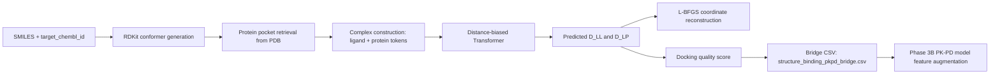
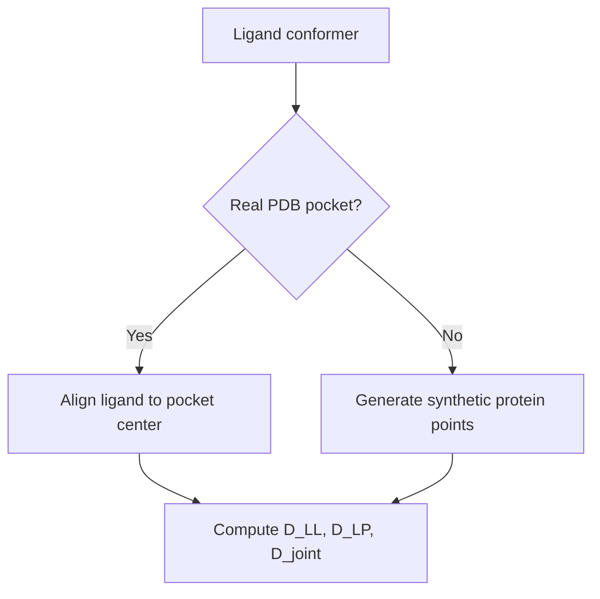
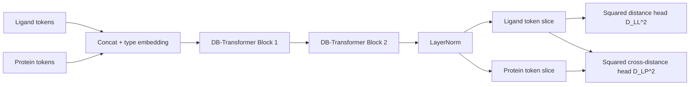

# RapidDock Paper-Aligned Prototype
## Copy-Paste Ready PPT Content (Technical + Reviewer Friendly)

Use each section below as one slide.
Recommended flow: 18-20 slides.

---

## Slide 1: Title and Context
### Title
RapidDock Paper-Aligned Prototype for Structure-Aware PK-PD Bridging

### On-slide bullets
- Educational implementation aligned to core RapidDock ideas.
- Joint protein-ligand modeling with distance-biased attention.
- End-to-end bridge: structure -> binding -> PK-PD feature augmentation.

### Speaker notes
This deck summarizes a prototype that is conceptually close to RapidDock but computationally lightweight. The main objective is to preserve key geometric and mechanistic ideas while keeping the pipeline runnable for thesis experimentation.

---

## Slide 2: Motivation and Research Gap
### On-slide bullets
- Traditional QSAR often misses explicit 3D protein-ligand geometry.
- Docking-only pipelines may not transfer easily into PK-PD modeling.
- Need an interpretable bridge from structural predictions to downstream pharmacology.

### Theory snippet
- Let ligand coordinates be X_L and protein coordinates be X_P.
- Key geometric supervision is pairwise distance structure:
  - ligand-ligand matrix D_LL
  - ligand-protein matrix D_LP

### Speaker notes
Our gap is not only prediction quality; it is continuity between structural modeling and pharmacological decision layers.

---

## Slide 3: End-to-End Pipeline Overview
### Diagram (paste into Mermaid-enabled slide tools)

### On-slide bullets
- Real data where possible, synthetic fallback where necessary.
- Geometry prediction and reconstruction are both evaluated.
- Final output directly feeds Neural ODE PK-PD training.

---

## Slide 4: Data Sources and Prototype Assumptions
### Table
| Component | Source | In Prototype | Why |
|---|---|---|---|
| Ligand identity | ChEMBL CSV | Real | Preserves realistic medicinal chemistry input |
| Ligand 3D | RDKit MMFF conformers | Generated | Fast and reproducible geometry baseline |
| Protein context | RCSB PDB | Real where mapped | Introduces target-specific structural context |
| Protein features | Random vectors | Synthetic placeholder | Keeps focus on geometry-learning framework |
| Targets | 8 mapped ChEMBL IDs | Real mapping | Enables structure-conditioned analysis |

### Speaker notes
This is intentionally hybrid realism: realistic ligand/protein geometry handling plus lightweight feature encoders.

---

## Slide 5: Complex Builder Logic
### On-slide bullets
- If real pocket exists:
  - translate ligand conformer to pocket center
  - compute geometric targets with real pocket residues
- Otherwise:
  - sample synthetic protein context near ligand centroid
- Always produce:
  - protein_feat, protein_xyz, ligand_feat, ligand_xyz
  - D_LL, D_LP, D_joint

### Diagram

---

## Slide 6: Distance-Biased Transformer (Concept)
### Theory
Attention with geometric bias:
- Standard score: QK^T / sqrt(d_h)
- Biased score: QK^T / sqrt(d_h) - alpha * D_joint

Where:
- D_joint is pairwise distance matrix across concatenated ligand+protein tokens.
- alpha is bias_scale (set in model).

### On-slide bullets
- Brings near tokens into stronger interaction context.
- Preserves transformer flexibility while injecting geometric priors.

---

## Slide 7: Detailed Architecture (Block-Level)
### Table
| Block | Input | Operation | Output | Purpose |
|---|---|---|---|---|
| Token projection | ligand_feat, protein_feat | Linear projections + type embeddings | joint token tensor | Unify modalities |
| DB-MHA | tokens, D_joint, masks | distance-biased self-attention | contextual tokens | Geometry-aware interaction |
| FFN block | contextual tokens | MLP with GELU + residual | refined tokens | Nonlinear feature mixing |
| Output heads | ligand/protein token slices | squared-distance computation | pred D_LL^2, pred D_LP^2 | Stable geometric target prediction |

### Speaker notes
The model predicts squared distances to avoid unstable sqrt gradients during training.

---

## Slide 8: Architecture Diagram

---

## Slide 9: Symmetry-Aware Loss
### Problem
Ligands may have repeated atom types, so multiple atom index orderings are equivalent.

### Method
- Group ligand atoms by repeated type.
- Generate limited permutations.
- Evaluate loss for each permutation.
- Backprop only on permutation with minimum objective.

### Formula
L = min_pi ( L_LL(pi) + L_LP(pi) )

### On-slide bullets
- Reduces artificial penalties from atom indexing artifacts.
- Better aligns optimization with molecular symmetry.

---

## Slide 10: Training Setup
### Table
| Item | Setting |
|---|---|
| Epochs | 50 |
| Optimizer | Adam |
| Initial LR | 1e-3 |
| Scheduler | CosineAnnealingLR |
| LR min | 1e-5 |
| Gradient clipping | 1.0 |
| Selection criterion | Best validation loss |
| Checkpoint | data/outputs/rapid_dock_best.pt |

### On-slide bullets
- Per-sample training loop (batch size effectively 1 sample per step).
- Loss is MSE over squared distance matrices.

---

## Slide 11: Reconstruction Objective (L-BFGS)
### On-slide bullets
- Input: predicted D_LL and D_LP, known protein coordinates.
- Optimize ligand coordinates with L-BFGS.
- Objective combines ligand-ligand and ligand-protein distance mismatch.

### Formula
min_X ||cdist(X, X) - D_LL|| + ||cdist(X, X_P) - D_LP||

### Speaker notes
This turns pairwise distance predictions into explicit 3D coordinates, enabling geometric quality metrics like RMSD.

---

## Slide 12: Reconstruction Metrics
### Table
| Metric | Meaning | Why it matters |
|---|---|---|
| Raw RMSD | Direct coordinate error | Absolute geometric agreement |
| Kabsch RMSD | Rigid-body aligned error | Shape fidelity independent of pose orientation |
| CDF thresholds (<1A, <2A, <3A) | Fraction of acceptable reconstructions | Practical docking quality interpretation |

### On-slide bullets
- Kabsch-aligned RMSD is the key geometry-quality indicator.
- Histogram + CDF provide distribution-level reliability.

---

## Slide 13: Structure-to-Binding Bridge Definition
### On-slide bullets
- Docking score = mean predicted ligand-protein distance.
- Lower docking score implies tighter predicted interaction.
- Define docking_quality = -docking_score for intuitive higher-is-better scale.

### Table
| Bridge Field | Definition | Direction |
|---|---|---|
| docking_score | mean(predicted D_LP) | lower is better |
| docking_quality | -docking_score | higher is better |
| pchembl_value | measured binding potency | higher is better |

---

## Slide 14: Statistical Bridge Evaluation
### On-slide bullets
- Compute Pearson correlation between docking score and pChEMBL.
- Evaluate on:
  - all samples
  - real-pocket subset only
- Also compute per-target correlations.

### Table
| Analysis Layer | Statistic | Interpretation |
|---|---|---|
| Global | Pearson r | Overall structure-binding association |
| Real-pocket subset | Pearson r | Association under strongest structural realism |
| Per-target | target-level r, p-value | Target-specific consistency and heterogeneity |

---

## Slide 15: PK-PD Integration Path
### Diagram

### On-slide bullets
- bridge CSV is exported for downstream training.
- input feature dimension is extended by docking_quality.

---

## Slide 16: Limitations and Scientific Validity
### Table
| Limitation | Current Choice | Risk | Upgrade Path |
|---|---|---|---|
| Protein residue features | Random vectors | Missed sequence-structure signal | ESM-2 residue embeddings |
| Ligand placement realism | Conformer translation to pocket center | Pose realism gap | Vina/DiffDock poses |
| Atom features | one-hot atomic type surrogate | limited chemistry richness | richer atom-level fingerprints |
| Prototype scale | lightweight design | may underfit complex regimes | larger model + distributed training |

---

## Slide 17: Practical Outputs for Thesis Pipeline
### On-slide bullets
- Best model checkpoint for rapid reuse.
- Bridge dataset exported to:
  - data/outputs/structure_binding_pkpd_bridge.csv
- Visualization outputs:
  - loss curves
  - RMSD histogram/CDF
  - bridge scatter + per-target breakdown

### Table
| Output Artifact | Consumer |
|---|---|
| rapid_dock_best.pt | continued prototype experiments |
| structure_binding_pkpd_bridge.csv | Phase 3B PK-PD feature engineering |
| Reconstruction plots | geometry quality validation |

---

## Slide 18: Key Takeaways
### On-slide bullets
- Prototype successfully links structural geometry learning to PK-PD modeling.
- Distance-biased attention + symmetry-aware loss are the core technical contributions.
- Bridge formulation operationalizes structure-derived signal for downstream pharmacology.
- Phase-appropriate next step: replace placeholders (protein features, poses) while keeping architecture skeleton.

### Closing line
This notebook is not just a demo model; it is a scaffold for structure-informed pharmacological modeling.

---

## Optional Appendix Slide A: Hyperparameter Snapshot
| Hyperparameter | Value |
|---|---:|
| d_model | 64 |
| n_layers | 2 |
| n_heads | 4 |
| bias_scale | 0.25 |
| epochs | 50 |
| lr | 1e-3 |
| lr_min | 1e-5 |
| grad_clip | 1.0 |

## Optional Appendix Slide B: Suggested Figure Placement
| Figure Source in Notebook | Recommended Slide |
|---|---|
| Training curve (cosine LR) | Training Setup |
| True vs reconstructed 3D scatter | Reconstruction Objective |
| RMSD histogram + CDF | Reconstruction Metrics |
| Structure-binding scatter | Statistical Bridge Evaluation |
| Per-target bar chart | Statistical Bridge Evaluation |
